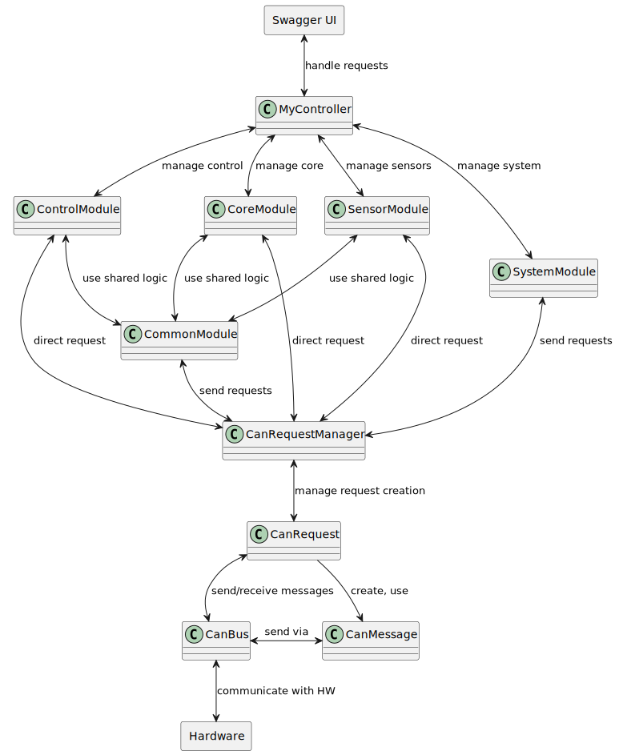

# SMBR-api-server
Server providing an API for controlling SMBR and retrieving data.


## Project Status
This project is actively developed in the `dev` branch. The `main` branch contains the stable release version. Changes from dev are periodically merged into `main`. You can see the version changes in `Changelog.md`.

## Requirements
- CMake 3.20 or later
- OATPP 1.4.0
- OATPP-Swagger 1.4.0
- SocketCAN
- Boost Asio

## Installing Dependencies
1. Install CMake:
    ```sh
    sudo apt install cmake
    ```
2. Install OATPP:
    ```sh
    git clone https://github.com/oatpp/oatpp
    cd oatpp
    mkdir build && cd build
    cmake ..
    make install
    ```
3. Install OATPP-Swagger:
    ```sh
    git clone https://github.com/oatpp/oatpp-swagger
    cd oatpp-swagger
    mkdir build && cd build
    cmake ..
    make install
    ```
4. Install SocketCAN:
    ```sh
    sudo apt install can-utils
    ```
5. Install Boost Asio:
    ```sh
    sudo apt-get install libboost-all-dev
    ```

## Building the Project
1. Clone this repository:
    ```sh
    git clone git@github.com:TrendBit/SMBR-api-server.git
    cd SMBR-api-server
    git checkout dev
    git submodule update --init --recursive
    ```
2. Create a build directory and compile the project:
    ```sh
    mkdir build && cd build
    cmake ..
    make
    ```

## Running the Application
1. After a successful compilation, run the server:
    ```sh
    ./Server
    ```

## Verifying Functionality
1. Verify that the application is running on the correct port (default is 8089):
    Open a web browser on the device you are connected to via SSH and go to URL: `http://ip_address_of_rpi:8089/swagger/ui` and test endpoints.

## Project Structure
```
SMBR-api.server
├── oatpp-server/
│   ├── controller/                       
│   │   ├── MyController.cpp
│   │   └── MyController.hpp
│   ├── dto/
│   │   ├── ModuleEnum.hpp             
│   │   ├── MyPingResponseDto.hpp           
│   │   ├── MyLoadResponseDto.hpp          
│   │   ├── MyCoreTempResponseDto.hpp                  
│   │   ├── MyModuleActionRequestDto.hpp       
│   │   ├── MyModuleInfoDto.hpp               
│   │   ├── MySupplyTypeResponseDto.hpp   
│   │   ├── MyIntensityDto.hpp   
│   │   └── MyTempDto.hpp        
│   ├── interceptors/
│   │   └── MyResponseInterceptor.hpp
│   ├── AppComponent.hpp
│   └── App.cpp                      
├──gate
│   ├── codes/
│   │   └── codes.hpp
│   ├── base/
│   │   ├── CommonModule.cpp   
│   │   └── CommonModule.hpp
│   ├── core/
│   │   ├── CoreModule.cpp               
│   │   └── CoreModule.hpp
│   ├── control/
│   │   ├── ControlModule.cpp             
│   │   └── ControlModule.hpp
│   ├── sensor/
│   │   ├── SensorModule.cpp             
│   │   └── SensorModule.hpp
│   ├── system/
│   │   ├── SystemModule.cpp             
│   │   └── SystemModule.hpp             
│   ├── can/
│   │   ├── CanIdGenerator.hpp               
│   │   ├── CanIdGenerator.cpp   
│   │   ├── CanMessage.hpp               
│   │   ├── CanMessage.cpp                            
│   │   ├── CanBus.hpp                   
│   │   ├── CanBus.cpp                   
│   │   ├── CanRequest.hpp               
│   │   ├── CanRequest.cpp               
│   │   ├── CanRequestManager.hpp        
│   │   └── CanRequestManager.cpp                  
│   └── error/
│       ├── ApiError.cpp                 
│       └── ApiError.hpp                                   
└── CMakeLists.txt  
```
## Class Diagram

This diagram was created using PlantUML.




## Project Diagram
```
+--------------------+         +----------------+         +------------------+      +-------------------------+
|     Swagger UI     |         |  oatpp-server  |         |      gate        |      | Hardware (Raspberry Pi) |
+--------------------+         +----------------+         +------------------+      +-------------------------+
           |                             |                         |                            |
           |                             |                         |                            |
           |----1.HTTP Request --------> |                         |                            |
           |                             |                         |                            |
           |                             |----2.Controller ----->  |                            |
           |                             |    (call API methods)   |                            |
           |                             |                         |                            |
           |                             |                         |                            |
           |                             |                         |----3.Send CAN Message ---> |
           |                             |                         |                            |
           |                             |                         |<---4.CAN Response -------- |
           |                             |                         |                            |
           |                             |<---5.Return Response -- |                            |
           |<---6.HTTP Response ---------|                         |                            |
           |                             |                         |                            |
```

